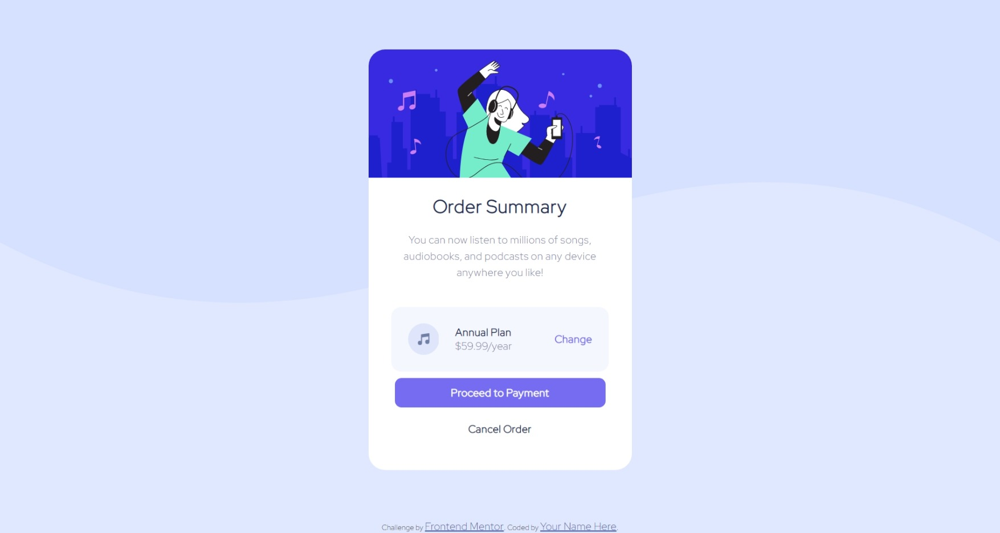

# Frontend Mentor - Order summary card solution

This is a solution to the [Order summary card challenge on Frontend Mentor](https://www.frontendmentor.io/challenges/order-summary-component-QlPmajDUj). Frontend Mentor challenges help you improve your coding skills by building realistic projects. 

## Table of contents

- [Overview](#overview)
  - [The challenge](#the-challenge)
  - [Screenshot](#screenshot)
  - [Links](#links)
- [My process](#my-process)
  - [Built with](#built-with)
  - [What I learned](#what-i-learned)
  - [Continued development](#continued-development)
  - [Useful resources](#useful-resources)
- [Author](#author)
- [Acknowledgments](#acknowledgments)

**Note: Delete this note and update the table of contents based on what sections you keep.**

## Overview

### The challenge

Users should be able to:

- See hover states for interactive elements

### Screenshot

### Links

- Solution URL: [Solution](https://github.com/OctaviusFarrel/order-summary-component)
- Live Site URL: [Live Site](https://octaviusfarrel.github.io/order-summary-component/)

## My process

### Built with

- CSS custom properties
- Flexbox

### What I learned

I took this challenge so that i can improve my CSS skill, it's fun to design your website using pure CSS, sure it can be hard sometimes, but it's fun when you got used to it.

### Continued development

I haven't learned some CSS properties, so i will definitely focus on that

### Useful resources

- [viewBox in svg](https://css-tricks.com/scale-svg/) - This article helped me figured out how to scale svg so that i can resize it however i want.

## Author

- Me (i guess)

## Acknowledgments

Thank you for my friend who recommended me [this website](https://www.frontendmentor.io/challenges) to learn how to improve my skill on front end side of web.
